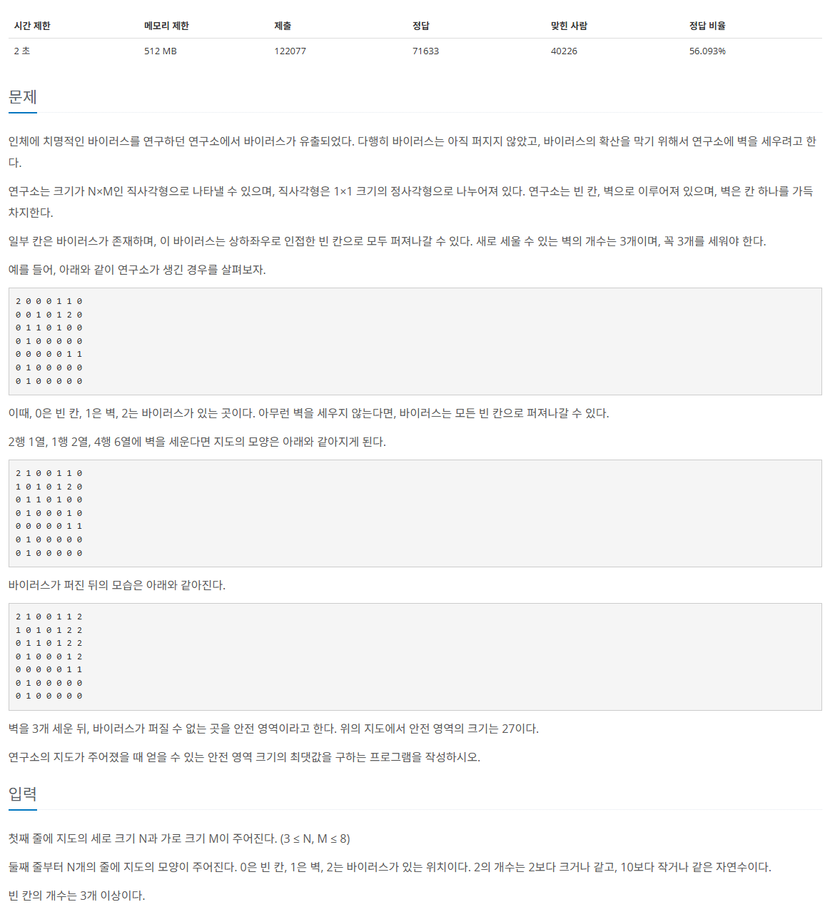

### input.txt 입력 설명
test case 개수 3개가 맨 윗 줄에 있습니다.
```
import sys
sys.stidin = open("2468_input.txt", "r")

T = int(input())
for tc in range(1, 1+T)
```
로 test case 순서대로 입력받아서 돌릴경우 이용이 용이하도록 작성되었습니다.